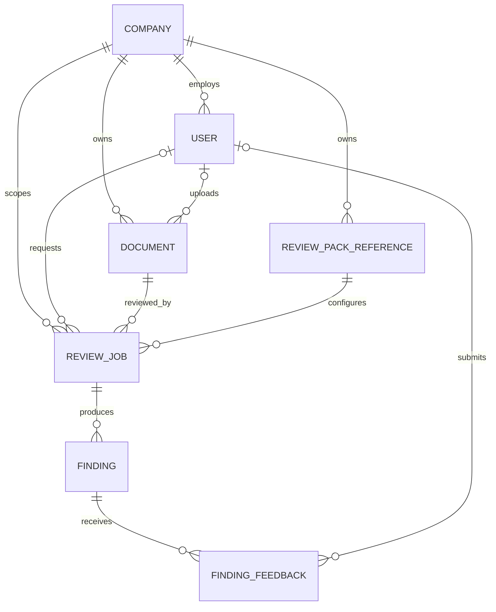
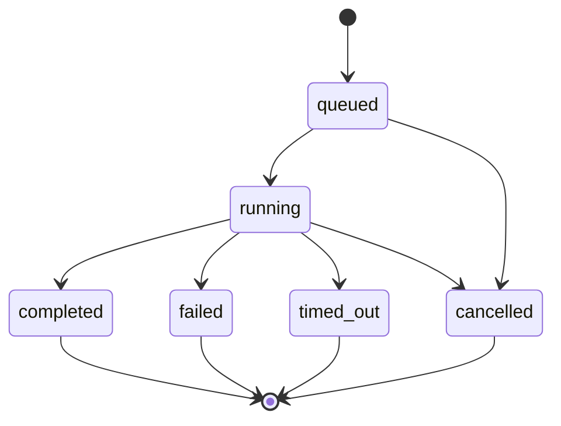

# Модель данных Product Application

**Версия:** 1.0  
**Статус:** сущности, state machine и persistence layer реализованы

## Границы модели

Product Application хранит жизненный цикл проверки и неизменённый результат
Analysis Core. Содержание Review Pack, промпты, таксономия и логика поиска дефектов
в эту модель не входят.

`Company` задаёт будущую границу арендатора, а `User` — автора действия. На этапе
MVP они не реализуют аутентификацию, роли или SSO, но их идентификаторы входят в
связи сразу, чтобы позднее не переносить уже накопленные документы и результаты.

Общие соглашения:

- первичные ключи — UUID, создаваемые приложением;
- даты — timezone-aware UTC;
- `ReviewJob.id` является внутренним ключом, `run_id` — отдельным идентификатором
  CLI-контракта;
- ссылки на файлы хранятся как непрозрачные относительные storage keys, не как
  пользовательские абсолютные пути;
- все связи должны принадлежать одной `Company`;
- исходный `ReviewResult` и нормализованный `Finding` после сохранения неизменяемы;
- отсутствие полной авторизации в MVP не отменяет фильтрацию данных по `company_id`.

## ER-диаграмма

Исходник диаграммы для импорта и редактирования расположен в
[`diagrams/application-data-model.mmd`](./diagrams/application-data-model.mmd).



## Сущности

### Company

Граница владения данными компании.

| Поле | Тип | Правило |
|---|---|---|
| `id` | UUID | Primary key |
| `slug` | string | Уникальный стабильный машинный ключ |
| `display_name` | string | Отображаемое название |
| `is_active` | boolean | Новые операции запрещены для неактивной компании |
| `created_at` | datetime | UTC, неизменяемое |
| `updated_at` | datetime | UTC |

Для локального MVP создаётся одна системная компания. Это seed, а не специальная
ветка бизнес-логики.

### User

Минимальная ссылка на участника без хранения пароля и реализации авторизации.

| Поле | Тип | Правило |
|---|---|---|
| `id` | UUID | Primary key |
| `company_id` | UUID | Обязательная ссылка на `Company` |
| `external_subject` | string/null | Будущий идентификатор OIDC, уникален внутри компании |
| `display_name` | string | Имя для интерфейса и аудита |
| `email` | string/null | Не используется как ключ доступа |
| `is_active` | boolean | Деактивация вместо удаления |
| `created_at` | datetime | UTC, неизменяемое |
| `updated_at` | datetime | UTC |

### Document

Метаданные загруженного оригинала. Содержимое файла находится в файловом или
объектном хранилище.

| Поле | Тип | Правило |
|---|---|---|
| `id` | UUID | Primary key |
| `company_id` | UUID | Владелец документа |
| `uploaded_by_user_id` | UUID/null | Автор загрузки; может отсутствовать у системного импорта |
| `original_filename` | string | Без директорий и управляющих символов |
| `media_type` | string | Определённый сервером MIME type |
| `size_bytes` | integer | Неотрицательный размер принятого файла |
| `sha256` | string | 64 hex-символа, вычисляется сервером |
| `storage_key` | string | Уникальный непрозрачный ключ внутри storage root |
| `created_at` | datetime | UTC, неизменяемое |
| `deleted_at` | datetime/null | Только логическое удаление в MVP |

Одинаковый SHA-256 не означает одну сущность: повторная загрузка может иметь иного
автора, имя и жизненный цикл. Индекс по `(company_id, sha256)` используется для
поиска, но не задаёт уникальность.

### ReviewPackReference

Не содержимое пакета, а неизменяемая ссылка на конкретную опубликованную версию.

| Поле | Тип | Правило |
|---|---|---|
| `id` | UUID | Primary key |
| `company_id` | UUID | Компания-владелец |
| `pack_key` | string | Стабильный ID пакета |
| `version` | string | Версия allowlist-записи; должна совпасть с манифестом |
| `display_name` | string | Совместимый служебный снимок; UI получает название из манифеста |
| `document_type` | string | Совместимый служебный снимок; UI получает тип из манифеста |
| `locator` | string | Путь или storage key, разрешаемый backend |
| `checksum` | string/null | Контроль неизменности опубликованной версии |
| `is_active` | boolean | Можно ли выбирать пакет для нового запуска |
| `created_at` | datetime | UTC, неизменяемое |

Пара `(company_id, pack_key, version)` уникальна. Использованная версия не
редактируется задним числом; новая редакция получает новую `version`.
Название, тип и описание для каталога читаются из серверного `pack.yaml`.
Пакет скрывается, если его `id` или `version` не совпадают с allowlist-записью.
Каталог возвращает название компании из `Company`, не доверяя манифесту право
назначать tenant. В demo-режиме разрешённый корень сканируется по структуре
`<pack-id>/<version>/pack.yaml`, после чего валидные версии регистрируются в БД.

### ReviewJob

Один запуск проверки одного документа одним Review Pack. Повтор создаёт новый job.

| Поле | Тип | Правило |
|---|---|---|
| `id` | UUID | Primary key приложения |
| `run_id` | string | Уникальный ID, передаваемый Analysis Core |
| `idempotency_key` | string/null | Уникален внутри компании; защищает создание job от двойного submit |
| `company_id` | UUID | Явная tenant-граница для очереди и запросов |
| `document_id` | UUID | Неизменяемая ссылка на `Document` |
| `review_pack_reference_id` | UUID | Неизменяемая ссылка на версию пакета |
| `requested_by_user_id` | UUID/null | Пользователь или системный запуск |
| `retry_of_job_id` | UUID/null | Ссылка на предыдущий terminal job при пользовательском повторе |
| `status` | enum | `queued`, `running`, `completed`, `failed`, `timed_out`, `cancelled` |
| `raw_result` | JSON/null | Исходный `ReviewResult`, без преобразований |
| `schema_version` | string/null | Снимок версии контракта |
| `engine_version` | string/null | Снимок версии Analysis Core |
| `model_name` | string/null | Снимок модели |
| `prompt_versions` | JSON/null | Снимок версий промптов |
| `error_code` | string/null | Машинный код отдельно от пользовательского текста |
| `user_error_message` | string/null | Безопасный текст для пользователя |
| `diagnostic_message` | string/null | Внутренняя диагностика, не выдаётся пользователю напрямую |
| `error_retriable` | boolean/null | Признак допустимости нового запуска |
| `process_pid` | integer/null | PID отдельного процесса Analysis Core, сохраняемый при переходе в `running` |
| `created_at` | datetime | UTC, неизменяемое |
| `queued_at` | datetime | Момент постановки в очередь |
| `started_at` | datetime/null | Момент перехода в `running` |
| `completed_at` | datetime/null | Заполняется только для `completed` |
| `failed_at` | datetime/null | Заполняется только для `failed` |
| `timed_out_at` | datetime/null | Заполняется только для `timed_out` |
| `cancelled_at` | datetime/null | Заполняется только для `cancelled` |
| `updated_at` | datetime | UTC |

`raw_result` заполняется не более одного раза. Точные состояния, временные
инварианты и ошибки описаны ниже и реализованы независимо от persistence layer.

### Подготовка ReviewResult к хранению

`prepare_review_result_snapshot` получает уже проверенный по JSON Schema результат
и SHA-256 сохранённого `Document`, после чего формирует единый снимок для будущей
транзакции repository layer:

```text
validated ReviewResult + Document.sha256
                 │
                 ├── raw_result без удаления неизвестных полей
                 ├── schema/core/pack/model/prompt versions
                 └── FindingProjection[] в исходном порядке
```

Снимок глубоко копирует входной объект, поэтому последующее изменение данных
вызывающей стороной не меняет подготовленный raw result или findings. Нормализация
копирует значения Analysis Core без переформулирования, округления confidence или
изменения location. Для completed-результата SHA-256 из контракта обязан совпадать
с SHA-256 сущности `Document`; failed-результат использует SHA-256 документа из
приложения, поскольку сокращённый контракт ошибки не содержит блока `document`.

Валидация JSON Schema и совпадения `run_id` остаются ответственностью приёмщика
результата из `NIK-05-05`. Repository layer дополнительно сверяет `run_id`, SHA-256
и Review Pack, после чего атомарно записывает raw result, версии и все findings.

Приёмщик доверяет только `runs/{run_id}/output/result.json` после exit code `0`.
Он ограничивает размер файла, требует строгий UTF-8 и JSON object, проверяет JSON
Schema 1.x, `run_id` и PID процесса. Только после всех проверок единая транзакция
записывает неизменённый raw result и проекции findings. Неизвестная major-версия,
невалидный файл и результат terminal job не изменяют базу данных.

## State machine ReviewJob

Исходник диаграммы расположен в
[`diagrams/review-job-state-machine.mmd`](./diagrams/review-job-state-machine.mmd),
исполняемые правила — в `docreview_api.models.review_job_state`.



Правила переходов:

- terminal states `completed`, `failed`, `timed_out`, `cancelled` неизменяемы;
- повтор не возвращает job в `queued`, а создаёт новый `ReviewJob` с новым `run_id`
  и `retry_of_job_id`;
- `retriable` является подсказкой для явного пользовательского повтора, но не
  запускает автоматический retry; сервис допускает retry только terminal job;
- пользовательские сообщения выбираются из статического каталога по согласованной
  паре exit code и `error.code`; ограниченный `stderr` и технические детали хранятся
  только в `diagnostic_message`;
- timestamps используют UTC, не могут двигаться назад и заполняются только для
  реально достигнутых состояний;
- `failed`, `timed_out` и `cancelled` требуют машинный `error_code` и безопасное
  пользовательское сообщение;
- общий timeout фиксируется как `ANALYSIS_TIMEOUT` до завершения процесса и допускает
  новый пользовательский запуск; отмена фиксируется как `ANALYSIS_CANCELLED` и не
  считается retriable;
- после фиксации `timed_out` или `cancelled` поздний результат не принимается, потому
  что terminal state запрещает переход в `completed`;
- `completed`, `queued` и `running` не могут содержать ошибку;
- диагностическое сообщение хранится отдельно и не является пользовательским;
- зависший `running` job после перезапуска worker переводится в `failed` с кодом
  вроде `WORKER_INTERRUPTED`; автоматическое переоткрытие того же job запрещено.

Очередь MVP хранится в той же БД, что и `ReviewJob`. Worker атомарно меняет самый
старый `queued` job на `running` условным update: конкурентный worker не сможет
захватить ту же запись. Транзакция захвата завершается до запуска Analysis Core и
не удерживает блокировку на всё время анализа. При старте worker восстанавливает
`running` job, чей `updated_at` старше настроенного safety window; окно обязано быть
больше process timeout вместе с grace period.

Worker зависит от интерфейса `ReviewJobQueue`, а не от деталей SQLAlchemy.
`DatabaseReviewJobQueue` является первым транспортом; будущий адаптер Celery/Redis
заменяет доставку и захват, сохраняя `ReviewJobService`, исполнитель процесса,
приём результата и state machine без изменений.

### Finding

Проекция одного замечания из `ReviewJob.raw_result` для фильтрации и UI.

| Поле | Тип | Правило |
|---|---|---|
| `id` | UUID | Внутренний primary key |
| `company_id` | UUID | Совпадает с компанией job |
| `review_job_id` | UUID | Обязательная ссылка на `ReviewJob` |
| `core_finding_id` | string | Исходный `finding.id` |
| `ordinal` | integer | Стабильный порядок в исходном массиве |
| `defect_id` | string | Исходный тип дефекта |
| `severity` | enum | `critical`, `high`, `medium`, `low` |
| `confidence` | decimal | Значение от 0 до 1 без изменения смысла |
| `location` | JSON | Исходная location, включая неизвестные дополнительные поля |
| `quote` | text | Исходная цитата |
| `problem` | text | Описание возможной проблемы |
| `clarification` | text | Что требуется уточнить |
| `detected_by` | JSON | Исходный список проверок |
| `created_at` | datetime | UTC, неизменяемое |

Пара `(review_job_id, core_finding_id)` и пара `(review_job_id, ordinal)` уникальны.
Повторный приём одного результата выполняется идемпотентно и не создаёт копии.

### FindingFeedback

Отдельное пользовательское решение, которое никогда не изменяет `Finding` или
`ReviewJob.raw_result`.

| Поле | Тип | Правило |
|---|---|---|
| `id` | UUID | Primary key |
| `company_id` | UUID | Совпадает с компанией finding |
| `finding_id` | UUID | Обязательная ссылка на `Finding` |
| `submitted_by_user_id` | UUID/null | Пользователь, если авторизация доступна |
| `actor_key` | string | Неперсональный ключ пользователя или локальной сессии |
| `decision` | enum | Словарь определяется в `NIK-09-01` |
| `comment` | text/null | Необязательное пояснение |
| `created_at` | datetime | UTC, неизменяемое |
| `updated_at` | datetime | UTC, обновляется при изменении решения |

Пара `(finding_id, actor_key)` уникальна и служит ключом upsert. Изменяется только
feedback; исходное замечание остаётся неизменным.

## Связи и инварианты

| Родитель | Потомок | Кардинальность | Инвариант |
|---|---|---:|---|
| `Company` | `User` | 1:N | Пользователь принадлежит одной компании |
| `Company` | `Document` | 1:N | Документ принадлежит одной компании |
| `Company` | `ReviewPackReference` | 1:N | Версия пакета принадлежит одной компании |
| `Document` | `ReviewJob` | 1:N | Один job проверяет ровно один документ |
| `ReviewPackReference` | `ReviewJob` | 1:N | Job фиксирует ровно одну версию пакета |
| `User` | `ReviewJob` | 0..1:N | Допускаются системные запуски |
| `ReviewJob` | `Finding` | 1:0..20 | Findings принадлежат только своему результату |
| `Finding` | `FindingFeedback` | 1:N | Не более одного решения на actor key |

Backend обязан до записи проверять равенство `company_id` у job, документа, пакета,
пользователя и создаваемых findings/feedback. ORM-связь сама по себе не считается
проверкой tenant isolation.

При создании нового задания backend также проверяет, что компания и пользователь
активны, документ не удалён, а выбранная версия Review Pack активна. Повтор с тем же
`idempotency_key` и теми же параметрами возвращает ранее созданный job; повторное
использование ключа с другими параметрами отклоняется как конфликт.

## Правила удаления

В MVP нет неявного физического удаления. Обычные API-операции используют следующие
правила:

| Сущность | Обычная операция | Поведение внешних ключей |
|---|---|---|
| `Company` | Деактивация | Hard delete запрещён при наличии любых дочерних данных (`RESTRICT`) |
| `User` | Деактивация | Исторические ссылки сохраняются; при санкционированном purge допускается `SET NULL` |
| `Document` | `deleted_at` | Hard delete запрещён, пока существуют jobs (`RESTRICT`) |
| `ReviewPackReference` | `is_active=false` | Использованную версию удалить нельзя (`RESTRICT`) |
| `ReviewJob` | Не удаляется обычным API | Явный tenant purge удаляет feedback → findings → job |
| `Finding` | Не удаляется отдельно | Удаляется только вместе с job; feedback удаляется каскадно внутри purge |
| `FindingFeedback` | Может очищаться отдельно | Не влияет на Finding и raw result |

Физический файл документа и диагностические артефакты удаляются только отдельным
идемпотентным retention/purge-сервисом после успешной транзакции БД. Конкретные
сроки, точки отсчёта и безопасная граница будущего tenant purge зафиксированы в
[`storage-retention-policy.md`](./storage-retention-policy.md). Истечение срока в
MVP не запускает удаление.

## Граница следующих этапов

- `NIK-03-02` реализован доменным модулем и тестами без зависимости от ORM.
- `NIK-03-03` реализован как lossless snapshot и нормализованная проекция findings.
- `NIK-03-04` реализован через SQLAlchemy 2, Alembic и repository layer.
- `NIK-03-05` реализован как конфигурируемый расчёт retention eligibility и
  неисполняемый tenant-scoped purge plan; автоматическое удаление запрещено.
