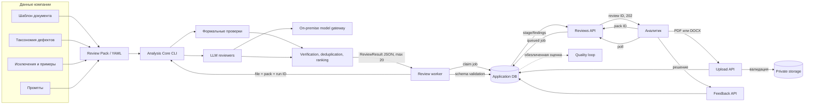
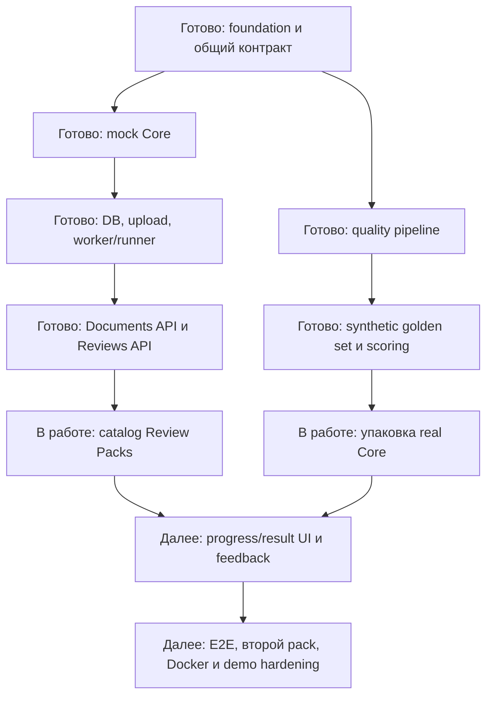

# DocReview Platform — продуктовые и дополнительные материалы

**Версия:** промежуточная, 3 сентября 2026 года.  
**Статус:** продуктовые гипотезы, технический прогресс и план проверки до финальной защиты.

# Часть I. Продуктовые материалы

## Пользователь и проблема

Первичный пользователь — аналитик, который готовит техническое задание перед
передачей разработчикам. Его задача — обнаружить потенциально неоднозначные,
неполные или противоречивые места до начала разработки, не перечитывая вручную
сотни полей несколько раз.

Вторичные пользователи результата — разработчики и тестировщики: они получают более
ясные требования и реже возвращают документ на уточнение. Владельцем решения может
быть руководитель продуктовой, аналитической или quality-функции.

В исходном кейсе техническое задание может содержать таблицы примерно на 300 полей.
Документ последовательно читают несколько команд, ручной анализ занимает порядка
2–3 часов, однако часть проблем всё равно обнаруживается только на разработке или
тестировании. Это приводит к повторному чтению, согласованию и доработкам.

## Продуктовая гипотеза

Если дать аналитику перед передачей документа в разработку 10–15 конкретных,
локализованных замечаний, сформированных с учётом правил его компании, то доля
существенных неоднозначностей, обнаруженных до разработки, вырастет, а время команд
на повторное чтение и согласование снизится.

## Ценностное предложение

- **Для аналитика:** дополнительная пара глаз, которая показывает, куда смотреть и
  что уточнить, но не присваивает себе экспертное решение.
- **Для команды:** меньше поздних возвратов требований и связанных переделок.
- **Для компании:** единый on-premise механизм контроля документов, адаптируемый
  через версионируемый пакет корпоративных знаний.

## Почему это платформа

Общими для разных компаний остаются загрузка, очередь, жизненный цикл проверки,
вызов модели, формат замечаний, UI и feedback. Для новой компании меняется Review
Pack:

- ожидаемая структура документа;
- таксономия дефектов;
- разрешённые исключения;
- prompts и few-shot примеры;
- правила severity, ранжирования и лимита результата.

Первый прикладной кейс становится одним профилем универсального document review
engine, а подключение новой компании не требует форка приложения.

## Вклад AI Product и связь с технической реализацией

| Продуктовое решение | Основание | Техническая реализация |
|---|---|---|
| Оптимизировать полноту с бюджетом | Пропущенная ошибка хуже лишнего вопроса, но 10–15 замечаний — целевой объём, 20 — потолок | Candidate generation, verification/ranking, `maxItems: 20`, Recall@20 |
| Не переписывать текст | Пользователю нужен контроль, а не соавтор | В finding только location, quote, problem и clarification |
| Проверять финальный документ | Основная боль возникает перед передачей в разработку | Асинхронный upload/review flow вместо realtime-редактора |
| Учитывать намеренные исключения | Не вся формальная неполнота является ошибкой | Исключения и enabled checks в Review Pack |
| Работать внутри контура | Внешние API запрещены в production | OpenAI-compatible model gateway и локальная Qwen3 |
| Масштабироваться на компании | Задача шире одного прикладного кейса | Нейтральное приложение и YAML Review Packs без hardcoded defect IDs |
| Учиться на решениях эксперта | Полезность определяется аналитиком | Отдельная FindingFeedback-модель и планируемая выгрузка в quality loop |

## Границы MVP

### В MVP входит

- загрузка PDF и DOCX;
- один документ на один review;
- выбор из разрешённых Review Packs;
- локальная OpenAI-совместимая LLM;
- формальные и LLM-проверки;
- асинхронное выполнение, polling, timeout и безопасные ошибки;
- не более 20 локализованных findings;
- решение аналитика по finding;
- два профиля на демонстрации: прикладной и generic technical specification.

### В MVP не входит

- автоматическое переписывание документа или замена человеческого ревью;
- realtime-подсказки во время набора текста;
- интеграция с Confluence/MCP;
- обучение модели после каждого пользовательского решения;
- произвольная загрузка исполняемых правил и prompts;
- OCR любых сканов и поддержка всех офисных форматов;
- полная enterprise-аутентификация и горизонтальное масштабирование.

## Основной пользовательский сценарий

1. Аналитик загружает финальный PDF или DOCX.
2. Приложение проверяет файл и безопасно сохраняет его.
3. Аналитик выбирает опубликованный Review Pack.
4. Backend создаёт idempotent review job и сразу возвращает идентификатор.
5. Worker запускает Analysis Core отдельно от HTTP-запроса, UI показывает состояние.
6. Core выполняет формальные и LLM-проверки через внутренний model gateway, проверяет
   цитаты и ранжирует findings.
7. Backend валидирует JSON и сохраняет результат.
8. Аналитик просматривает карточки с местом, цитатой, возможной проблемой и тем, что
   следует уточнить.
9. Аналитик принимает или отклоняет замечания и самостоятельно меняет документ.

## Текущее состояние пользовательского сценария

| Состояние | Что видит пользователь | Реализация |
|---|---|---|
| Upload | Зона загрузки, проверка формата и размера | Реализовано |
| Pack selection | Разрешённые пакеты с названием и версией | Следующий этап |
| Waiting/analysis | Безопасная стадия и polling | Backend реализован, UI предстоит |
| Result ready | Список findings и навигация | API реализован, UI предстоит |
| Failed/timed out | Понятная ошибка и новый запуск | Backend реализован, UI предстоит |
| Feedback | Решение и комментарий аналитика | Модель данных реализована, API/UI предстоят |

## Предварительные критерии успеха

### Качество обнаружения

| Метрика | Предварительный целевой порог | Статус |
|---|---:|---|
| Recall@20 по существенным дефектам | ≥ 80% | Требует итогового прогона |
| Citation/Location Accuracy | ≥ 95% | Требует итогового прогона |
| Precision@20 на оценке эксперта | ≥ 60% | Есть промежуточные оценки, методику нужно унифицировать |
| Число findings | обычно 10–15, всегда ≤ 20 | Ограничение зафиксировано контрактом |
| Ложные срабатывания на чистом контроле | не более 3 на документ | Требует итогового прогона |

Recall выбран главным критерием по обратной связи кейсодателя: пропущенная ошибка
хуже дополнительного вопроса. Precision остаётся ограничителем доверия и
когнитивной нагрузки.

### Пользовательская полезность

| Метрика | Рабочая гипотеза |
|---|---:|
| Доля findings, признанных полезными | ≥ 60% |
| Документы хотя бы с одним принятым замечанием | ≥ 70% документов с известными дефектами |
| Снижение времени первого ревью | ≥ 30% относительно ручных 2–3 часов |
| Понятность замечания | ≥ 4 из 5 по оценке аналитика |

Эти пороги являются целями, а не достигнутыми результатами.

### Техническая готовность

- review создаётся без ожидания модели;
- повторная отправка не создаёт дубликат;
- completed result проходит JSON Schema validation;
- внутренние пути, prompts и model config не попадают в API;
- два Review Pack работают без изменения приложения;
- основной и резервный E2E demo проходят повторяемо.

## Что уже измерено

- Synthetic corpus: 5 документов, 65 дефектов, 25 типов; инварианты генерации
  выполнены.
- В материалах контура качества зафиксирована precision 83% на слепой внутренней
  разметке и 58% на внешней разметке кейсодателя. Методика должна сопровождать
  следующие значения.
- Product Application: backend — 213 passed / 1 skipped, coverage 91,97%; mock core
  — 45 passed, coverage 95,82%; frontend — 14 passed, production build успешен.

## План проверки гипотезы до финала

1. Зафиксировать версии Core, модели, prompts, taxonomy и synthetic corpus.
2. Запустить pipeline на пяти испорченных и пяти чистых документах.
3. Посчитать Recall@20 отдельно для `presence`, `absence`, `section_removed`, а также
   для LLM и deterministic слоёв.
4. Посчитать precision и ложные срабатывания слепой экспертной оценкой.
5. Проверить точность цитат автоматически и выборочно вручную.
6. Сравнить с существующим решением на одном наборе, если baseline доступен.
7. Провести наблюдаемый сценарий с аналитиком: время, принятые findings и ясность.
8. Разобрать промахи по типам и повторить замер без изменения тестового набора.

## Ключевые допущения и риски

| Допущение или риск | Вероятность / влияние | Проверка или снижение риска |
|---|---|---|
| Synthetic defects не отражают реальные возвраты ТЗ | Высокая / высокая | Внешняя слепая оценка на документах кейсодателя |
| При приоритете recall пользователь утонет в придирках | Средняя / высокая | Предел 20, ranking и feedback |
| Намеренные пропуски вызовут false positive | Высокая / средняя | Exclusions в Review Pack и чистые контроли |
| LLM выдаст неверную цитату или JSON | Средняя / высокая | Citation check, schema validation и безопасная ошибка |
| Контекст 4096 токенов недостаточен | Высокая / высокая | Структурный parsing/chunking и длинный тестовый документ |
| Локальная модель недоступна на защите | Средняя / высокая | Connectivity preflight и резервный demo-result |
| Analysis Core не совпадёт с CLI/JSON-контрактом | Средняя / высокая | Упаковка зависимостей и contract tests |
| Платформенность останется декларацией | Средняя / высокая | Второй Review Pack и документ другой структуры |
| Приватные данные попадут в публичный Git | Низкая / критическая | Synthetic data, ignore rules и проверка истории |

## Открытые вопросы к кейсодателю

1. Какой минимальный Recall@20 считается убедительным?
2. Какие типы замечаний обязательны независимо от лимита?
3. Как учитывать дефект отсутствия, у которого нет дословной цитаты?
4. Какие исключения глобальны, а какие относятся к конкретному шаблону?
5. Можно ли получить обезличенный baseline существующего решения?
6. Какой feedback считать истинной меткой: первое решение аналитика или результат
   согласования с разработчиком?

# Часть II. Дополнительные материалы

## Архитектура и поток данных



## Границы модулей

| Модуль | Получает | Возвращает | Не содержит |
|---|---|---|---|
| Product Application | Пользователя, файл, pack ID | UI, статусы, findings, feedback | Таксономию и prompts |
| Analysis Core | Файл, Review Pack, model config, run ID | JSON по общей схеме | HTTP, пользователей и UI |
| Review Pack | Шаблон, taxonomy, exclusions, prompts | Версионированные правила | Код приложения и секреты |
| Model Gateway | Messages и inference-параметры | Ответ модели | Публичное хранение документов |

## Текущий технический прогресс



## Уже реализованные технические компоненты

- Python/FastAPI backend и React/TypeScript frontend;
- JSON Schema результата, exit codes и сгенерированные TypeScript-типы;
- CLI-совместимый mock с успешными и ошибочными сценариями;
- модель данных, миграции, state machine и tenant isolation;
- безопасная загрузка PDF/DOCX и атомарное хранение;
- durable DB queue, worker, process runner, timeout, отмена и retry;
- приём и валидация результата, проекция findings;
- Documents API и асинхронный Reviews API с idempotency и polling;
- UI загрузки документа;
- LLM-review pipeline, детерминированные проверки и YAML-таксономия;
- генератор synthetic golden set и scoring по классам дефектов.

## Демонстрационные сценарии

### A. Product Application с mock Core

1. Запустить frontend, API и worker одной командой.
2. Загрузить PDF или DOCX через UI.
3. Показать opaque document ID без раскрытия storage path.
4. Создать review и показать мгновенный `202 Accepted`.
5. Показать polling статуса и выдачу 12 локализованных findings.
6. Повторить запрос с тем же idempotency key и показать отсутствие дубля.
7. Включить timeout/model unavailable и показать безопасную ошибку.

**Статус:** backend-цепочка готова; UI после upload ещё требуется соединить с
выбором pack, progress и result screens.

### B. Контур качества

1. Сгенерировать synthetic corpus.
2. Показать clean/defective/truth тройку документа.
3. Запустить формальный слой и LLM review.
4. Посчитать совпадения отдельно для presence, absence и section removal.
5. Показать почти чистый документ как контроль галлюцинаций.
6. Показать unmatched defects и false positives, а не только среднюю метрику.

**Статус:** generator, 5 документов, 65 truth-дефектов, deterministic checks и scorer
находятся в репозитории. Требуется зафиксировать зависимости Analysis Core.

### C. Финальный E2E и доказательство платформенности

```text
Upload документа
→ выбор Review Pack
→ очередь и worker
→ реальный Analysis Core
→ локальная Qwen3
→ schema-valid ReviewResult
→ карточки findings
→ решение аналитика
```

Затем тот же сценарий повторяется с generic-документом и другим Review Pack без
изменения или пересборки приложения.

**Статус:** запланировано до финальной защиты.

## Проверяемые артефакты

| Доказательство | Расположение в репозитории |
|---|---|
| Общий CLI/JSON-контракт | `INTEGRATION_CONTRACT.md`, `contracts/` |
| Backend и worker | `apps/api/` |
| Frontend и upload UI | `apps/web/` |
| CLI-совместимый mock | `apps/mock-analysis-core/` |
| Quality pipeline | `run_review.py`, `check_formal.py`, `score.py` |
| Taxonomy и шаблон | `defects.yaml`, `defects_prompt.yaml`, `template.yaml` |
| Synthetic corpus | `data/synth/` |
| Архитектура и API | `docs/application-data-model.md`, `docs/api-conventions.md` |

## Подтверждённые инженерные проверки

| Контур | Результат последнего подтверждённого прогона |
|---|---|
| Backend | 213 passed, 1 skipped; coverage 91,97% |
| Mock Analysis Core | 45 passed; coverage 95,82% |
| Frontend | 14 passed; lint, typecheck и production build успешны |
| Real Analysis Core после merge | Нужна фиксация зависимости `requests`; не выдаётся за зелёный прогон |

## Что пока нельзя заявлять

- полностью завершённый UI просмотра результатов;
- production-ready развёртывание;
- доказанную экономию времени на реальной пользовательской выборке;
- финальный Recall@20;
- подтверждённую платформенность до успешного прогона второго Review Pack.
