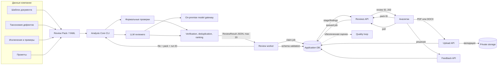
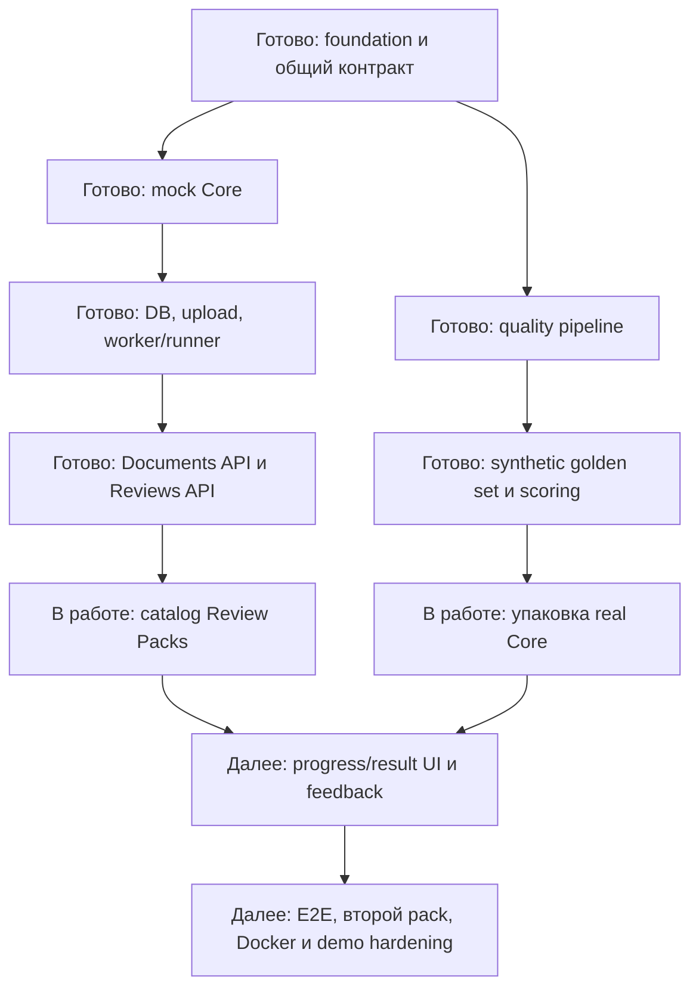

# DocReview Platform — дополнительные материалы

**Версия:** промежуточная, 3 сентября 2026 года.

## Архитектура и поток данных



## Границы компонентов

| Компонент | Получает | Возвращает | Не содержит |
|---|---|---|---|
| Product Application | Пользователя, файл, pack ID | UI, статусы, findings, feedback | Таксономию и prompts |
| Analysis Core | Файл, Review Pack, model config, run ID | JSON по общей схеме | HTTP, пользователей и UI |
| Review Pack | Шаблон, taxonomy, exclusions, prompts | Версионированные правила | Код приложения и секреты |
| Model Gateway | Messages и inference-параметры | Ответ модели | Публичное хранение документов |

## Текущий прогресс



## Реализованные компоненты

- Python/FastAPI backend и React/TypeScript frontend;
- JSON Schema результата, exit codes и TypeScript-типы;
- CLI-совместимый mock с успешными и ошибочными сценариями;
- модель данных, миграции, state machine и tenant isolation;
- безопасная загрузка PDF/DOCX и атомарное хранение;
- durable DB queue, worker, process runner, timeout, отмена и retry;
- приём и валидация результата, проекция findings;
- Documents API и Reviews API с idempotency и polling;
- UI загрузки документа;
- LLM-review pipeline, детерминированные проверки и YAML-таксономия;
- генератор synthetic golden set и scoring по классам дефектов.

## Пример данных

Каждое замечание возвращается в структурированном виде:

```json
{
  "defect_id": "AMBIGUOUS_LOGIC",
  "severity": "high",
  "confidence": 0.91,
  "location": {
    "page": 8,
    "section_path": ["Алгоритм расчёта", "Шаг 3"],
    "block_id": "block-42"
  },
  "quote": "Берётся последняя запись за месяц",
  "problem": "Не определён выбор при одинаковом времени событий",
  "clarification": "Уточнить дополнительное правило сортировки"
}
```

Формат принуждает решение ссылаться на конкретное место и не позволяет подменять
ревью автоматическим переписыванием документа.

## Предварительные результаты

| Контур | Подтверждённый результат |
|---|---|
| Synthetic golden set | 5 документов, 65 дефектов, 25 типов |
| Классы дефектов | 40 presence, 21 absence, 4 section removed |
| Backend | 213 passed, 1 skipped; coverage 91,97% |
| Mock Analysis Core | 45 passed; coverage 95,82% |
| Frontend | 14 passed; lint, typecheck и production build успешны |
| Real Analysis Core после merge | Требуется фиксация зависимости `requests`; зелёный прогон пока не заявляется |

## Демонстрационный сценарий A — Product Application с mock Core

1. Запустить frontend, API и worker одной командой.
2. Загрузить PDF или DOCX через UI.
3. Показать opaque document ID без раскрытия storage path.
4. Создать review и получить мгновенный `202 Accepted`.
5. Показать polling статуса и выдачу 12 findings.
6. Повторить запрос с тем же idempotency key и показать отсутствие дубля.
7. Включить timeout/model unavailable и показать безопасную ошибку.

**Текущий статус:** backend-цепочка готова; UI после upload требуется соединить с
выбором pack, progress и result screens.

## Демонстрационный сценарий B — измеримый контур качества

1. Сгенерировать synthetic corpus.
2. Показать clean/defective/truth тройку одного документа.
3. Запустить формальный слой и LLM review.
4. Посчитать результаты отдельно для presence, absence и section removal.
5. Показать почти чистый документ как контроль галлюцинаций.
6. Показать unmatched defects и false positives, а не только среднюю метрику.

**Текущий статус:** generator, truth-разметка, deterministic checks и scorer находятся
в репозитории; для повторяемого запуска требуется зафиксировать зависимости Core.

## Планируемый финальный E2E

```text
Upload документа
→ выбор Review Pack
→ очередь и worker
→ реальный Analysis Core
→ локальная Qwen3
→ schema-valid ReviewResult
→ карточки findings
→ решение аналитика
```

После основного сценария тот же процесс повторяется с generic-документом и другим
Review Pack без изменения или пересборки приложения. Второй проход служит
доказательством платформенности.

## Проверяемые артефакты в репозитории

| Доказательство | Расположение |
|---|---|
| Общий CLI/JSON-контракт | `INTEGRATION_CONTRACT.md`, `contracts/` |
| Backend и worker | `apps/api/` |
| Frontend и upload UI | `apps/web/` |
| CLI-совместимый mock | `apps/mock-analysis-core/` |
| Quality pipeline | `run_review.py`, `check_formal.py`, `score.py` |
| Taxonomy и шаблон | `defects.yaml`, `defects_prompt.yaml`, `template.yaml` |
| Synthetic corpus | `data/synth/` |

## Текущие ограничения

- полностью завершённый UI просмотра результатов ещё не готов;
- production-развёртывание пока не заявляется;
- экономия времени на реальной пользовательской выборке не измерена;
- финальный Recall@20 ещё не зафиксирован;
- платформенность требует успешного прогона второго Review Pack.
