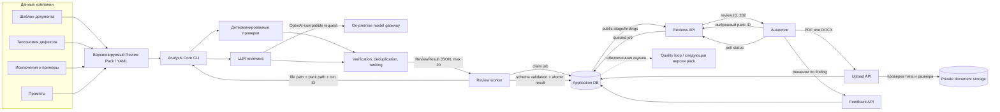
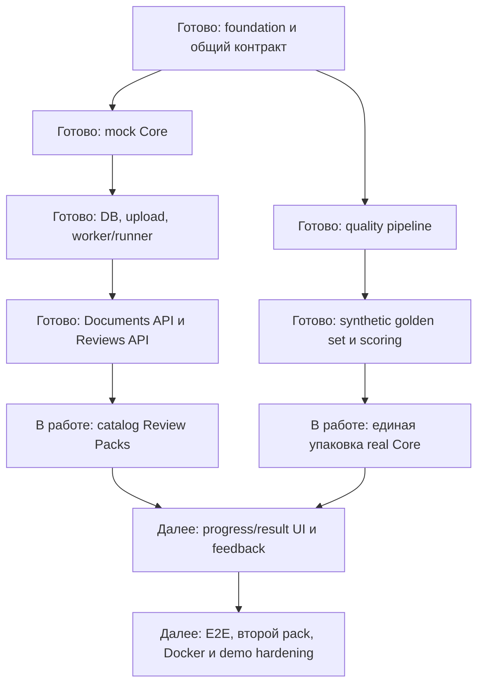

# Архитектура и текущий прогресс

## Поток данных



## Границы модулей

| Модуль | Получает | Возвращает | Не содержит |
|---|---|---|---|
| Product Application | Пользователя, файл, pack ID | UI, статусы, findings, feedback | Таксономию и prompts |
| Analysis Core | Путь к файлу, Review Pack, model config, run ID | JSON по общей схеме | HTTP, пользователей и UI |
| Review Pack | Шаблон, taxonomy, exclusions, prompts | Версионированные правила анализа | Код приложения и секреты |
| Model Gateway | Messages и параметры inference | Ответ модели | Документы в публичном облаке |

## Текущий статус



## Что уже можно продемонстрировать

- запуск приложения одной командой и health diagnostics;
- загрузку валидного PDF/DOCX и отказ для небезопасного файла;
- создание review без блокировки HTTP-запроса;
- повторную отправку без дублирования job;
- polling `queued/running/completed/failed` и отдельную выдачу findings;
- mock-сценарии: 0, 12 и 20 findings, timeout, invalid JSON, model unavailable;
- генерацию пяти synthetic документов и их truth-разметки;
- архитектурную независимость приложения от prompts, модели и defect IDs.

## Что пока нельзя заявлять

- полностью завершённый UI просмотра результатов;
- production-ready развёртывание;
- доказанную экономию времени на реальной пользовательской выборке;
- финальный Recall@20;
- подтверждённую платформенность до работы второго Review Pack.


---

# Демонстрационные сценарии и доказательства прогресса

## Сценарий A — Product Application с mock Core

Цель: показать готовность приложения независимо от состояния модели.

1. Запустить frontend, API и worker одной командой.
2. Загрузить PDF или DOCX через UI.
3. Показать сохранённый opaque document ID без раскрытия storage path.
4. Создать review и показать мгновенный `202 Accepted`.
5. Показать изменение статуса через polling.
6. Получить 12 локализованных findings из стандартного mock-сценария.
7. Повторить тот же запрос с idempotency key и показать отсутствие дубля.
8. Переключить mock на timeout/model unavailable и показать безопасную ошибку.

**Статус:** backend-цепочка готова; UI после upload ещё требуется соединить с
выбором pack, progress и result screens.

## Сценарий B — Контур качества

Цель: показать, что качество измеряется, а не оценивается только по красивому ответу.

1. Сгенерировать synthetic corpus.
2. Показать clean/defective/truth тройку одного документа.
3. Запустить формальный слой и LLM review.
4. Посчитать совпадения отдельно для presence, absence и section removal.
5. Показать почти чистый `synth_3` как контроль галлюцинаций.
6. Показать не только среднюю метрику, но и unmatched defects/false positives.

**Статус:** generator, 5 документов, 65 truth-дефектов, deterministic checks и scorer
находятся в репозитории. Для воспроизводимого запуска после объединения веток нужно
зафиксировать зависимости Analysis Core.

## Сценарий C — финальный E2E

Цель: соединить продуктовую и качественную части.

```text
Upload документа
→ выбор NET Review Pack
→ очередь и worker
→ реальный Analysis Core
→ локальная Qwen3
→ schema-valid ReviewResult
→ карточки findings
→ решение аналитика
```

После этого без пересборки приложения повторить сценарий с generic-документом и
generic Review Pack. Именно второй проход является доказательством платформенности.

**Статус:** запланировано до финальной защиты.

## Проверяемые артефакты в репозитории

| Доказательство | Расположение |
|---|---|
| Общий CLI/JSON-контракт | `INTEGRATION_CONTRACT.md`, `contracts/` |
| Backend и worker | `apps/api/` |
| Frontend и upload UI | `apps/web/` |
| CLI-совместимый mock | `apps/mock-analysis-core/` |
| Quality pipeline | `run_review.py`, `check_formal.py`, `score.py` |
| Taxonomy и шаблон | `defects.yaml`, `defects_prompt.yaml`, `template.yaml` |
| Synthetic corpus | `data/synth/` |
| Подробная архитектура | `docs/application-data-model.md`, `docs/api-conventions.md` |
| Roadmap до demo/production | `roadmaps/` |

## Зафиксированные инженерные проверки

| Контур | Результат последнего подтверждённого прогона |
|---|---|
| Backend | 213 passed, 1 skipped; coverage 91,97% |
| Mock Analysis Core | 45 passed; coverage 95,82% |
| Frontend | 14 passed; lint, typecheck и production build успешны |
| Real Analysis Core после merge | Нужна установка/фиксация зависимости `requests`; не выдаётся за зелёный прогон |
