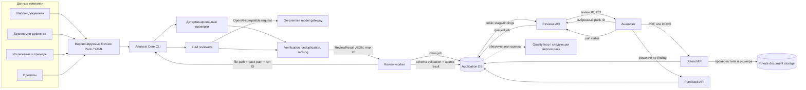
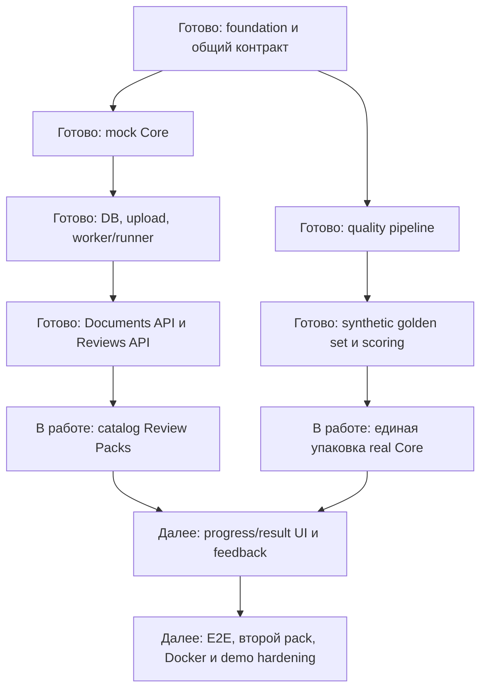

# Архитектура и текущий прогресс

## Поток данных

## Границы модулей

| Модуль | Получает | Возвращает | Не содержит |
|---|---|---|---|
| Product Application | Пользователя, файл, pack ID | UI, статусы, findings, feedback | Таксономию и prompts |
| Analysis Core | Путь к файлу, Review Pack, model config, run ID | JSON по общей схеме | HTTP, пользователей и UI |
| Review Pack | Шаблон, taxonomy, exclusions, prompts | Версионированные правила анализа | Код приложения и секреты |
| Model Gateway | Messages и параметры inference | Ответ модели | Документы в публичном облаке |

## Текущий статус

## Что уже можно продемонстрировать

- запуск приложения одной командой и health diagnostics;
- загрузку валидного PDF/DOCX и отказ для небезопасного файла;
- создание review без блокировки HTTP-запроса;
- повторную отправку без дублирования job;
- polling `queued/running/completed/failed` и отдельную выдачу findings;
- mock-сценарии: 0, 12 и 20 findings, timeout, invalid JSON, model unavailable;
- генерацию пяти synthetic документов и их truth-разметки;
- архитектурную независимость приложения от prompts, модели и defect IDs.

## Что пока нельзя заявлять

- полностью завершённый UI просмотра результатов;
- production-ready развёртывание;
- доказанную экономию времени на реальной пользовательской выборке;
- финальный Recall@20;
- подтверждённую платформенность до работы второго Review Pack.
